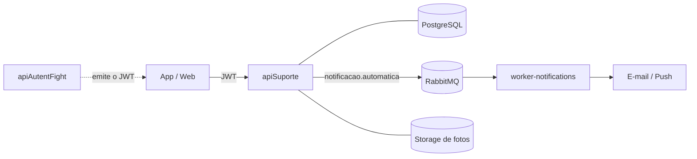

# API Suporte - FightConnect

API responsável por gerenciar tickets de suporte, chamados técnicos, atendimento ao cliente e comunicação com usuários do sistema FightConnect.

## 📋 Visão Geral

| Item | Descrição |
|------|-----------|
| **Java** | 21 |
| **Spring Boot** | 4.0.1 |
| **Banco de Dados** | PostgreSQL |
| **Message Queue** | RabbitMQ |
| **Arquitetura** | Clean Architecture (Domain, Application, Infrastructure) |

## 🎯 Funcionalidades Principais

### Tickets de Suporte
- Criar e gerenciar tickets de suporte
- Classificar tickets por categoria/prioridade
- Atribuir tickets a agentes de suporte
- Rastreamento de status (ABERTO, EM_PROGRESSO, RESOLVIDO, FECHADO)

### Atendimento
- Histórico de comunicação/comentários em tickets
- Respostas automáticas iniciais
- Escalonamento de tickets críticos
- SLA (Service Level Agreement) tracking

### Categorias de Suporte
- Problemas técnicos
- Dúvidas sobre funcionalidades
- Problemas de pagamento
- Relatórios de bugs
- Solicitações de features

### Notificações
- Notificar usuário quando ticket é atualizado
- Notificar agentes quando novo ticket é criado
- Integração com RabbitMQ para notificações assíncronas
- Suporte a email e push notifications

### Segurança
- OAuth2 Resource Server (JWT)
- Autorização baseada em roles (usuário, agente, administrador)
- Proteção de dados sensíveis

## 🔗 Integração com Outros Serviços

```
┌─────────────────────────┐
│ apiSuporte              │
├─────────────────────────┤
│ ↓ RabbitMQ              │
├─────────────────────────┤
│ • notificacao.email     │  → fightconnect-worker-notifications
│ • suporte.novo-ticket   │  → (broadcast)
│ • suporte.atualizado    │  → (subscribers)
│                         │
│ ↓ OAuth2 Resource       │
├─────────────────────────┤
│ • JWT validation        │  ← apiAutentFight
│ • User identification   │
│                         │
│ ↓ PostgreSQL            │
├─────────────────────────┤
│ • Tickets               │
│ • Comentários           │
│ • Categorias            │
└─────────────────────────┘
```

## 📦 Dependências Principais

```xml
<!-- Spring Boot & Data -->
<dependency>spring-boot-starter-data-jpa</dependency>
<dependency>spring-boot-starter-web</dependency>
<dependency>spring-boot-starter-webmvc</dependency>
<dependency>spring-boot-starter-validation</dependency>

<!-- Security & OAuth2 -->
<dependency>spring-boot-starter-security</dependency>
<dependency>spring-boot-starter-oauth2-resource-server</dependency>

<!-- PostgreSQL -->
<dependency>org.postgresql:postgresql</dependency>

<!-- RabbitMQ -->
<dependency>spring-boot-starter-amqp</dependency>

<!-- Mail -->
<dependency>spring-boot-starter-mail</dependency>

<!-- WebFlux (HTTP Client) -->
<dependency>spring-boot-starter-webflux</dependency>

<!-- Jackson for JSON -->
<dependency>jackson-datatype-jsr310</dependency>

<!-- Swagger -->
<dependency>springdoc-openapi-starter-webmvc-ui</dependency>

<!-- Utilities -->
<dependency>lombok</dependency>
```

## 🚀 Como Rodar

### Pré-requisitos
- Java 21
- PostgreSQL rodando
- RabbitMQ rodando
- Maven

### Passos
```bash
cd apiSuporte

# Compilar e instalar dependências
mvn clean install

# Rodar a aplicação
mvn spring-boot:run
```

### Variáveis de Ambiente
Configure `application.properties`:

```properties
# Database
spring.datasource.url=jdbc:postgresql://localhost:5432/fightconnect_suporte
spring.datasource.username=postgres
spring.datasource.password=seu_password
spring.jpa.hibernate.ddl-auto=update

# RabbitMQ
spring.rabbitmq.host=localhost
spring.rabbitmq.port=5672
spring.rabbitmq.username=guest
spring.rabbitmq.password=guest

# Mail (para notificações)
spring.mail.host=smtp.gmail.com
spring.mail.port=587
spring.mail.username=seu_email@gmail.com
spring.mail.password=sua_senha_app
spring.mail.properties.mail.smtp.auth=true
spring.mail.properties.mail.smtp.starttls.enable=true

# JWT (OAuth2)
spring.security.oauth2.resourceserver.jwt.issuer-uri=http://localhost:8000
```

## 📝 Endpoints Principais

### Tickets
```
GET    /api/suporte/tickets               - Listar tickets
POST   /api/suporte/tickets               - Criar novo ticket
GET    /api/suporte/tickets/{id}          - Obter detalhes do ticket
PUT    /api/suporte/tickets/{id}          - Atualizar ticket
DELETE /api/suporte/tickets/{id}          - Fechar/Deletar ticket
```

### Comentários em Tickets
```
GET    /api/suporte/tickets/{id}/comentarios  - Listar comentários
POST   /api/suporte/tickets/{id}/comentarios  - Adicionar comentário
```

### Agente (para atendimento)
```
GET    /api/suporte/tickets?status=ABERTO     - Listar tickets abertos
PUT    /api/suporte/tickets/{id}/atribuir     - Atribuir a agente
PUT    /api/suporte/tickets/{id}/status       - Atualizar status
```

### Categorias
```
GET    /api/suporte/categorias            - Listar categorias
POST   /api/suporte/categorias            - Criar categoria (admin)
```

### Prioridades
```
GET    /api/suporte/prioridades           - Listar prioridades
```

## 🏗️ Estrutura do Projeto

```
apiSuporte/
├── src/main/java/br/com/vibetex/
│   ├── ApiSuporteApplication.java
│   ├── application/
│   │   ├── controller/
│   │   │   ├── TicketController.java
│   │   │   ├── ComentarioController.java
│   │   │   ├── CategoriaController.java
│   │   │   └── NotificacaoController.java
│   │   ├── dto/
│   │   │   ├── TicketDTO.java
│   │   │   ├── ComentarioDTO.java
│   │   │   ├── CriarTicketRequest.java
│   │   │   └── AtualizarStatusRequest.java
│   │   ├── mapper/
│   │   └── service/
│   │       ├── TicketService.java
│   │       ├── ComentarioService.java
│   │       ├── CategoriaService.java
│   │       └── NotificacaoService.java
│   ├── domain/
│   │   ├── entity/
│   │   │   ├── Ticket.java
│   │   │   ├── Comentario.java
│   │   │   ├── Categoria.java
│   │   │   └── Prioridade.java
│   │   ├── repository/
│   │   │   ├── TicketRepository.java
│   │   │   ├── ComentarioRepository.java
│   │   │   └── CategoriaRepository.java
│   │   └── enum/
│   │       ├── StatusTicket.java
│   │       ├── PrioridadeEnum.java
│   │       └── RoleEnum.java
│   └── infrastructure/
│       ├── configuration/
│       │   ├── SecurityConfig.java
│       │   ├── RabbitMQConfig.java
│       │   └── MailConfig.java
│       ├── rabbitmq/
│       │   └── TicketEventProducer.java
│       └── mail/
│           └── EmailService.java
├── src/main/resources/
│   ├── application.properties
│   └── templates/
│       └── email/
│           ├── novo-ticket.html
│           ├── ticket-atualizado.html
│           └── ticket-resolvido.html
└── pom.xml
```

## 📊 Modelo de Dados

### Entidade: Ticket
```sql
CREATE TABLE tickets (
    id UUID PRIMARY KEY,
    titulo VARCHAR(255) NOT NULL,
    descricao TEXT NOT NULL,
    categoria_id UUID NOT NULL,
    prioridade VARCHAR(50) NOT NULL,
    status VARCHAR(50) NOT NULL DEFAULT 'ABERTO',
    usuario_criador_id UUID NOT NULL,
    agente_atribuido_id UUID,
    data_criacao TIMESTAMP DEFAULT CURRENT_TIMESTAMP,
    data_atualizacao TIMESTAMP DEFAULT CURRENT_TIMESTAMP,
    data_fechamento TIMESTAMP,
    FOREIGN KEY (categoria_id) REFERENCES categorias(id)
);
```

### Entidade: Comentario
```sql
CREATE TABLE comentarios (
    id UUID PRIMARY KEY,
    ticket_id UUID NOT NULL,
    usuario_id UUID NOT NULL,
    conteudo TEXT NOT NULL,
    data_criacao TIMESTAMP DEFAULT CURRENT_TIMESTAMP,
    FOREIGN KEY (ticket_id) REFERENCES tickets(id) ON DELETE CASCADE
);
```

## 🔄 Fluxo de Criação de Ticket

```
1. User cria ticket
   POST /api/suporte/tickets { titulo, descricao, categoria }

2. TicketService.criarTicket()
   - Cria entidade Ticket
   - Status = ABERTO
   - Atribui ID único

3. TicketEventProducer publica evento
   - Exchange: suporte.novo-ticket
   - Contém: ID, usuário, categoria

4. fightconnect-worker-notifications consome
   - Envia email para usuário confirmando ticket
   - Envia notificação para equipe de suporte

5. Usuário recebe confirmação
   - Email com número do ticket
   - Link para acompanhar status
```

## 📧 Produtores RabbitMQ

### Exchange: `suporte.novo-ticket`
Publicado quando novo ticket é criado
```json
{
  "ticketId": "uuid",
  "usuarioId": "uuid",
  "titulo": "string",
  "categoria": "string",
  "prioridade": "string",
  "dataHora": "ISO8601"
}
```

### Exchange: `suporte.atualizado`
Publicado quando ticket é atualizado
```json
{
  "ticketId": "uuid",
  "statusAnterior": "ABERTO",
  "statusNovo": "EM_PROGRESSO",
  "usuarioAtualizador": "uuid",
  "dataHora": "ISO8601"
}
```

### Exchange: `notificacao.email`
Envia email para usuário quando ticket é atualizado

## 🔐 Segurança

- OAuth2 Resource Server (JWT)
- Validação de token em cada request
- Autorização baseada em roles:
  - `USUARIO`: Pode criar tickets e ver seus próprios
  - `AGENTE`: Pode ver, atribuir e atualizar todos
  - `ADMIN`: Acesso total

### Proteção de Dados
- Validação de entrada (Jakarta Validation)
- Proteção contra CSRF
- SQL Injection prevention (JPA Parameterized queries)
- XSS prevention (Jackson XSS filter)

## 🧪 Testes

```bash
# Rodar testes
mvn test

# Testes específicos
mvn test -Dtest=TicketControllerTest
mvn test -Dtest=TicketServiceTest
```

## 🆘 Troubleshooting

### Tickets não sendo criados
- Verificar se PostgreSQL está acessível
- Verificar credenciais do banco de dados
- Verificar se JWT token é válido

### Emails não sendo enviados
- Verificar se RabbitMQ está rodando
- Verificar se credenciais SMTP estão corretas
- Verificar se [fightconnect-worker-notifications](../fightconnect-worker-notifications/README.md) está consumindo

### Erro de autenticação
- Verificar se issuer-uri do JWT está configurado
- Verificar se token é válido e não expirou

## 📚 Documentação API

Swagger UI disponível em:
```
http://localhost:8004/swagger-ui.html
```

## 🔗 Referências a Outros Projetos

| Projeto | Integração | Tipo |
|---------|-----------|------|
| [apiAutentFight](../apiAutentFight/README.md) | Autenticação | OAuth2 Server |
| [fightconnect-worker-notifications](../fightconnect-worker-notifications/README.md) | Notificações | RabbitMQ Consumer |

## 💡 Funcionalidades Futuras

- SLA tracking e alertas
- Respostas automáticas baseadas em IA
- Knowledge base/FAQ
- Chat em tempo real com agentes
- Pesquisa de satisfação

## 📞 Contato

Para dúvidas sobre a API Suporte, abra uma issue no repositório.

## 🏗️ Onde esta API entra na arquitetura

A apiSuporte é um dos microsserviços do FightConnect. Ela tem seu próprio banco PostgreSQL, valida o usuário pelo JWT emitido pela API de autenticação e, quando um ticket muda de status ou recebe resposta, publica uma notificação automática no RabbitMQ (fila `notificacao.automatica`). Quem envia o e-mail ou o push é o [fightconnect-worker-notifications](https://github.com/FightConnect2025/fightconnect-worker-notifications).



Decisões principais:

- **Banco por serviço.** O suporte não lê tabelas de outra API, o que mantém os serviços independentes.
- **Camadas separadas.** Controllers, serviços de aplicação e entidades de domínio (tickets, mensagens, status) ficam em pacotes distintos, e a regra de negócio fica nos serviços, não no controller.
- **Notificação desacoplada.** A API só publica o evento. Se o envio de e-mail falhar, o ticket continua salvo normalmente.

## 🔐 Variáveis de ambiente

Nenhuma credencial fica no código. Copie `.env.example` para `.env`:

| Variável | Uso |
|---|---|
| `DB_PASSWORD` | Senha do PostgreSQL (usada pelo Postgres e pela API) |
| `JWT_SECRET` | Segredo para validar os tokens JWT |
| `SPRING_RABBITMQ_*` | Conexão com o RabbitMQ |

```bash
cp .env.example .env
docker compose up -d
./mvnw spring-boot:run -Dspring-boot.run.profiles=dev
```
